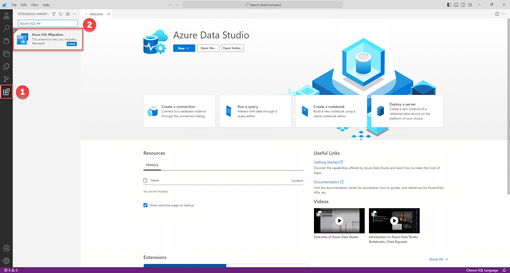

# Assessment and SKU recommendation for Azure SQL Database using Azure Data Studio

Assess your SQL Server databases for Azure SQL Database readiness or to identify any migration blockers before migrating them to Azure SQL Database.

[Azure Data Studio](https://learn.microsoft.com/en-us/azure-data-studio/what-is-azure-data-studio) is a unified tooling experience for data professionals.
Designed to focus on the functionality data platform developers use the most, Azure Data Studio offers additional experiences available as optional extensions. It's built for data professionals who use SQL Server and Azure databases on-premises or in multicloud environments.

The [Azure SQL migration extension for Azure Data Studio](https://learn.microsoft.com/en-us/sql/azure-data-studio/extensions/azure-sql-migration-extension?view=sql-server-ver16) enables you to assess, get Azure recommendations and migrate your SQL Server databases to Azure SQL.

## Prerequisites

- SQL Server with Windows authentication or SQL authentication access

## Getting Started

> [!CAUTION]
>
> - **Connect to the Jump Box VM**
> - VM name: **jb-migration**
> - Use the credentials provided on the deploy page.

## Installing Azure SQL Migration Extension

- Launch Azure Data Studio.
- Navigate to the "Extensions" tab located in the right-side menu.
- In the search bar, type "Azure SQL Migration" and press Enter.
- Locate the "Azure SQL Migration" extension from the search results.
- Click on the "Install" button next to the extension to begin the installation process.

## Connecting to SQL Server

After successfully installing the extension, follow these steps to connect to the SQL Server:

- Navigate to the "Connections" tab in the top menu.
- Click on "New Connection" to open the connection dialog.
- In the "Server" field, enter the following: `10.0.0.4`
- Choose "Windows Authentication" as the authentication type.
- Set "Trust server certificate" to "True".
- Click "Connect" to establish the connection to the SQL Server.

After establishing the connection, the Manage page will appear.

- Go to the sidebar menu and select "General" to find the "Azure SQL Migration" extension.
- Click on the "Azure SQL Migration" extension to open it and begin using its features for migration tasks.

## Exploring Azure SQL Migration Extension

After accessing the home page of Azure SQL Migration, follow these steps:

- Look for the "+ New migration" button and click on it.
- Choose all databases that you want to include in the assessment.
- Click "Next" to proceed to the next step in the migration process.

- Click on the checkbox to select all databases available for assessment.
- Alternatively, individually check the checkboxes next to each database to select them manually.
- Once all databases are selected, proceed to the next step in the migration process.

## Performance data collection and SKU recommendation

- After a few minutes, a summary will appear, allowing you to review the assessment for Azure SQL targets.
- To begin collecting data from your databases to determine the best SKU, click on "Start Data Collection". This will initiate the data collection process.
- Alternatively, if you have already collected data, you can import it.

- You need to wait for approximately 10 minutes before you can start seeing recommendations.
- After this time, you'll be able to explore the SKU recommendations.
- To stop collecting data, click on "Stop Data Collection".

- When you click on "View Details," you'll access a detailed report for the SKU recommended.
- Additionally, you have the option to save the recommendation report.

## Reviewing the assessment

After reviewing the SKU recommendation, click on the "Close" button to return to the summary page. From there, proceed by clicking "Next" to review any issues or blockers.

- Select "Azure SQL Database" as the target type.
- Navigate to the database named "AdventureWorks_with_issues".
- Click on the findings to view detailed information about the issues.
- Review issues or blockers for a specific database.

You can save your assessment and review it later.

## Page Navigator

- [SQL Server migration one-click PoC to Azure SQL](../../../README.md)
- [One-click PoC to Azure SQL DB](../../../AzureSQLDB/deploy/README.md)
- [One-click PoC to Azure SQL MI](../../../AzureSQLMI/deploy/README.md)
