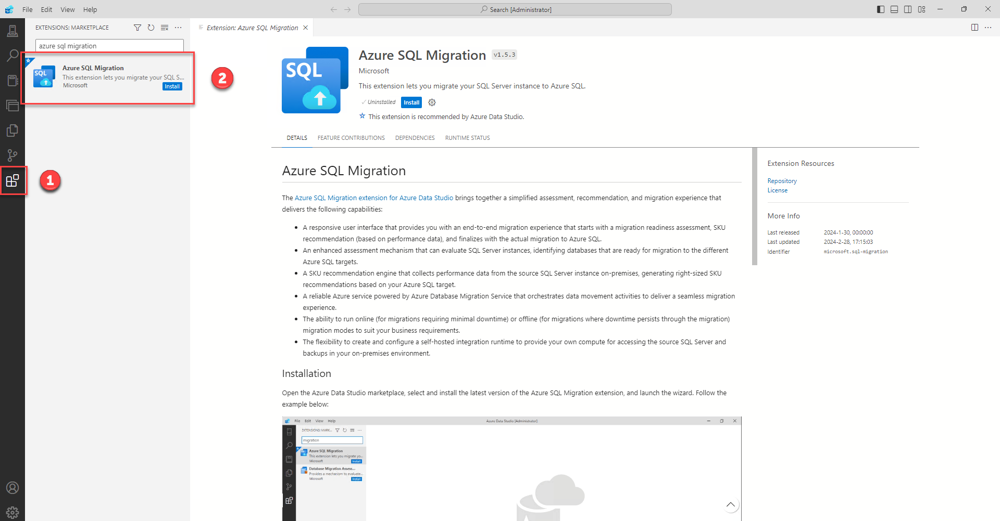

# Assessment and SKU recommendation for Azure SQL Database using Azure Data Studio

Assess your SQL Server databases for Azure SQL Database readiness or to identify any migration blockers before migrating them to Azure SQL Database.
Free account

[Azure Data Studio](https://learn.microsoft.com/en-us/azure-data-studio/what-is-azure-data-studio) is a unified tooling experience for data professionals.
Designed to focus on the functionality data platform developers use the most, Azure Data Studio offers additional experiences available as optional extensions. It's built for data professionals who use SQL Server and Azure databases on-premises or in multicloud environments.

The [Azure SQL migration extension for Azure Data Studio](https://learn.microsoft.com/en-us/sql/azure-data-studio/extensions/azure-sql-migration-extension?view=sql-server-ver16) enables you to assess, get Azure recommendations and migrate your SQL Server databases to Azure SQL.

## Prerequisites

- SQL Server with Windows authentication or SQL authentication access

## Getting Started

> [!CAUTION]
>
> - **Connect to the Jump Box VM**
> - VM name: **jb-migration**
> - Use the credentials provided on the deploy page.

## Installing Azure SQL Migration Extension

1. Launch Azure Data Studio.
2. Navigate to the "Extensions" tab located in the right-side menu.
3. In the search bar, type "Azure SQL Migration" and press Enter.
4. Locate the "Azure SQL Migration" extension from the search results.
5. Click on the "Install" button next to the extension to begin the installation process.



## Connecting to SQL Server

After successfully installing the extension, follow these steps to connect to the SQL Server:

1. Navigate to the "Connections" tab in the top menu.
2. Click on "New Connection" to open the connection dialog.
3. In the "Server" field, enter the following: `10.0.0.4`
4. Choose "Windows Authentication" as the authentication type.
5. Set "Trust server certificate" to "True".
6. Click "Connect" to establish the connection to the SQL Server.


After establishing the connection, the Manage page will appear.

1. Go to the sidebar menu and select "General" to find the "Azure SQL Migration" extension.
2. Click on the "Azure SQL Migration" extension to open it and begin using its features for migration tasks.


## Exploring Azure SQL Migration Extension

After accessing the home page of Azure SQL Migration, follow these steps:

1. Look for the "+ New migration" button and click on it.
2. Choose all databases that you want to include in the assessment.
3. Click "Next" to proceed to the next step in the migration process.


1. Click on the checkbox to select all databases available for assessment.
2. Alternatively, individually check the checkboxes next to each database to select them manually.
3. Once all databases are selected, proceed to the next step in the migration process.


After a few minutes, a summary will appear where you can review the assessment for Azure SQL targets.


1. Select "Azure SQL Database" as the target type.
2. Navigate to the database named "AdventureWorks_with_issues".
3. Click on the findings to view detailed information about the issues.
4. Review issues or blockers for a specific database.


You can save your assessment and review it later.

## Run the assessment

1. Run a SQL Server assessment using the ***Get-AzDataMigrationAssessment*** command.

    ```powershell
    Get-AzDataMigrationAssessment `
    -ConnectionString "Data Source=10.0.0.4,1433;Initial Catalog=master;User Id=sqladmin;Password=My`$upp3r`$ecret" `
    -OutputFolder "C:\temp\output" `
    -Overwrite
    ```

2. **Assessment at scale** using config file

    You can also create a config file to use as a parameter to run assessment on SQL servers. The config file has the following structure:

    ```json
    {
        "action": "Assess",
        "outputFolder": "C:\\temp\\output",
        "overwrite":  "True",
        "sqlConnectionStrings": [
            "Data Source=Server1.database.net;Initial Catalog=master;Integrated Security=True;",
            "Data Source=Server2.database.net;Initial Catalog=master;Integrated Security=True;"
        ]
    }

### Get SKU Recommendation

This step is optional. An Azure SQL DB has been already provisioned.

1. Get SKU recommendation using the **az datamigration get-sku-recommendation** command.

    ```powershell
    Get-AzDataMigrationSkuRecommendation `
    -OutputFolder "C:\temp\output" `
    -DisplayResult `
    -Overwrite `
    -TargetPlatform "AzureSqlDatabase"
    ```

    All results will be displayed after the command finishes.

    

2. Get SKU recommendations at scale using a config file.

    You can also create a config file to use as a parameter to get SKU recommendations on SQL servers. The config file has the following structure:

    ```json
    {
        "action": "GetSKURecommendation",
        "outputFolder": "C:\\temp\\Output",
        "overwrite":  "True",
        "displayResult": "True",
        "targetPlatform": "any",
        "scalingFactor": 1000
    }
    ```

    Learn more about using [PowerShell to get SKU recommendation](https://github.com/Azure-Samples/data-migration-sql/blob/main/PowerShell/sql-server-sku-recommendation.md#get-sku-recommendation-though-console-parameters)

### View Assessment & SKU Recommendation

1. **Azure Data Studio**

    Azure Data Studio now has the capability to import your results, allowing you to visualize them effortlessly.

    - Connect to SQL Server - 10.0.0.4
    - Select Azure SQL Migration
    - To import the assessment, navigate to the directory "C:\temp\Output" and locate a JSON file named "SqlAssessmentReport-*.json".
    
    - Select all databases and click Next
    
    - To import the performance data, simply navigate to the directory "C:\temp\Output" and select this folder.
    
    - Review SKU recommendation
    
    - Click Next
    - Review the assessment
    - Choose the target platform "Azure SQL Database" and then select the database to view all findings. For specific details on any particular issue, select that issue to see all related information.
    

    > [!IMPORTANT]
    > No need to proceed with the migration at the moment. Instead, you can review your assessment and SKU recommendations.

2. **HTML recommendations result**

    You can look into the output folder (C:\temp\output) to find an HTML file that also gives the details of the SKU being recommended.

    

## Page Navigator

- [SQL Server migration one-click PoC to Azure SQL](../../../README.md)
- [One-click PoC to Azure SQL DB](../../../AzureSQLDB/deploy/README.md)
- [One-click PoC to Azure SQL MI](../../../AzureSQLMI/deploy/README.md)
