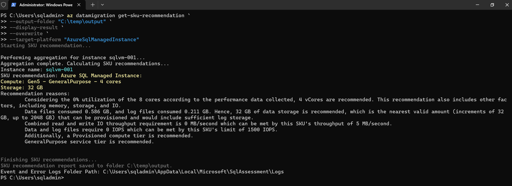
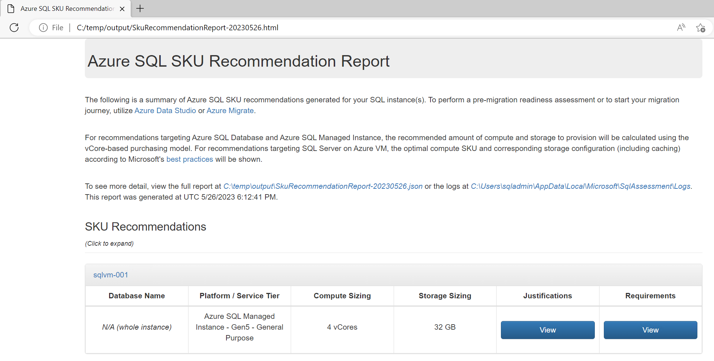

# Assessment and SKU recommendation for Azure SQL Managed Instance using PowerShell

Assess your SQL Server databases for Azure SQL Managed Instance readiness or to identify any migration blockers before migrating them to Azure SQL Managed Instance.

The [Azure SQL migration extension for Azure Data Studio](https://learn.microsoft.com/en-us/sql/azure-data-studio/extensions/azure-sql-migration-extension?view=sql-server-ver16) enables you to assess, get Azure recommendations and migrate your SQL Server databases to Azure SQL.

In addition, the Azure CLI command [az datamigration](https://learn.microsoft.com/en-us/cli/azure/datamigration?view=azure-cli-latest) can be used to manage data migration at scale.

## Prerequisites

- SQL Server with Windows authentication or SQL authentication access
- .Net Core 3.1 (Already installed)
- Az.DataMigration PowerShell module

## Getting Started

> [!CAUTION]
>
> - **Connect to the Jump Box VM**
> - VM name: **jb-migration**
> - Use the credentials provided on the deploy page.

Open a [Terminal](https://apps.microsoft.com/store/detail/windows-terminal/9N0DX20HK701?hl=en-us&gl=us). It is already installed in the VM and by default it uses PowerShell.

## Run the assessment

1. Run a SQL Server assessment using the ***Get-AzDataMigrationAssessment*** command.

    ```powershell
    Get-AzDataMigrationAssessment `
    -ConnectionString "Data Source=10.1.0.4,1433;Initial Catalog=master;User Id=sqladmin;Password=My`$upp3r`$ecret" `
    -OutputFolder "C:\temp\output" `
    -Overwrite
    ```

2. **Assessment at scale** using config file

    You can also create a config file to use as a parameter to run assessment on SQL servers. The config file has the following structure:

    ```json
    {
        "action": "Assess",
        "outputFolder": "C:\\temp\\output",
        "overwrite":  "True",
        "sqlConnectionStrings": [
            "Data Source=Server1.database.net;Initial Catalog=master;Integrated Security=True;",
            "Data Source=Server2.database.net;Initial Catalog=master;Integrated Security=True;"
        ]
    }
    ```

    The config file can be passed to the cmdlet in the following way

    ```powershell
    Get-AzDataMigrationAssessment -ConfigFilePath "C:\Users\user\document\config.json"
    ```

    > [!TIP]
    > To view the report, go to **C:\temp\output** folder and check the json file.

    Learn more about using [PowerShell to assess SQL Server](https://github.com/Azure-Samples/data-migration-sql/blob/main/PowerShell/sql-server-assessment.md)

## SKU Recommendation

### Performance data collection

This step is optional. An Azure SQL Managed Instance has been already provisioned.

1. Run a SQL Server performance data collection using the ***Get-AzDataMigrationPerformanceDataCollection*** command.

    ```powershell
    Get-AzDataMigrationPerformanceDataCollection `
    -SqlConnectionStrings "Data Source=10.1.0.4,1433;Initial Catalog=master;User Id=sqladmin;Password=My`$upp3r`$ecret" `
    -OutputFolder "C:\temp\output" `
    -PerfQueryInterval 10 `
    -NumberOfIterations 5 `
    -StaticQueryInterval 120
    ```

    > [!TIP]
    > Collect as much data as you want, then stop the process.
    > You can look into the output folder (**C:\temp\output**) to find a CSV file that also gives the details of the performance data collected.

2. Running **performance data collection at scale** using a config file

    You can also create a config file to use as a parameter to run performance data collection on SQL servers.
    The config file has the following structure:

    ```json
    {
        "action": "PerfDataCollection",
        "outputFolder": "C:\\temp\\output",
        "perfQueryIntervalInSec": 20,
        "staticQueryIntervalInSec": 120,
        "numberOfIterations": 7,
        "sqlConnectionStrings": [
            "Data Source=Server1.database.net;Initial Catalog=master;Integrated Security=True;",
            "Data Source=Server2.database.net;Initial Catalog=master;Integrated Security=True;"
        ]
    }
    ```

    The config file can be passed to the cmdlet in the following way.

    ```powershell
    Get-AzDataMigrationAssessment -ConfigFilePath "C:\Users\user\document\config.json" 
    ```

    > [!TIP]
    > Collect as much data as you want, then stop the process.
    > You can look into the output folder (**C:\temp\output**) to find a CSV file that also gives the details of the performance data collected.

    Learn more about using [PowerShell to perform data collection](https://github.com/Azure-Samples/data-migration-sql/blob/main/PowerShell/sql-server-sku-recommendation.md)

### Get SKU Recommendation

This step is optional. An Azure SQL Managed Instance has been already provisioned.

1. Get SKU recommendation using the **az datamigration get-sku-recommendation** command.

    ```powershell
    Get-AzDataMigrationSkuRecommendation `
    -OutputFolder "C:\temp\output" `
    -DisplayResult `
    -Overwrite `
    -TargetPlatform "AzureSqlManagedInstance"
    ```

    All results will be displayed after the command finishes.

    

2. Get SKU recommendations at scale using a config file.

    You can also create a config file to use as a parameter to get SKU recommendations on SQL servers. The config file has the following structure:

    ```json
    {
        "action": "GetSKURecommendation",
        "outputFolder": "C:\\temp\\Output",
        "overwrite":  "True",
        "displayResult": "True",
        "targetPlatform": "any",
        "scalingFactor": 1000
    }
    ```

    Learn more about using [PowerShell to get SKU recommendation](https://github.com/Azure-Samples/data-migration-sql/blob/main/PowerShell/sql-server-sku-recommendation.md#get-sku-recommendation-though-console-parameters)

3. HTML recommendations result

    > You can look into the output folder (C:\temp\output) to find an HTML file that also gives the details of the SKU being recommended.

    

## Page Navigator

- [SQL Server migration one-click PoC to Azure SQL](../../../README.md)
  
- [One-click PoC to Azure SQL DB](../../../AzureSQLDB/deploy/README.md)
  - ***Assessment and SKU recommendation***
    - [CLI](../../../AzureSQLDB/assessment/CLI/azuresqldb-assessment-sku-using-cli.md)
    - [PowerShell](../../../AzureSQLDB/assessment/PowerShell/azuresqldb-assessment-sku-using-ps.md)
  - ***Offline migration***
    - [CLI](../../../AzureSQLDB/migration/CLI/azuresqldb-offline-migration-using-cli.md)
    - [PowerShell](../../../AzureSQLDB/migration/PowerShell/azuresqldb-offline-migration-using-ps.md)
  
- [One-click PoC to Azure SQL MI](../../../AzureSQLMI/deploy/README.md)
  - ***Assessment and SKU recommendation***
    - [CLI](../../../AzureSQLMI/assessment/CLI/azuresqlmi-assessment-sku-using-cli.md)
    - [PowerShell](../../../AzureSQLMI/assessment/PowerShell/azuresqlmi-assessment-sku-using-ps.md)
  - ***Offline migration using Storage Account***
    - [CLI](../../../AzureSQLMI/migration/CLI/azuresqlmi-offline-migration-using-azure-storage-cli.md)
    - [PowerShell](../../../AzureSQLMI/migration/PowerShell/azuresqlmi-offline-migration-using-azure-storage-ps.md)
  - ***Offline migration using File Share***
    - [CLI](../../../AzureSQLMI/migration/CLI/azuresqlmi-offline-migration-using-file-share-cli.md)
    - [PowerShell](../../../AzureSQLMI/migration/PowerShell/azuresqlmi-offline-migration-using-file-share-ps.md)
  - ***Online migration using Storage Account***
    - [CLI](../../../AzureSQLMI/migration/CLI/azuresqlmi-offline-migration-using-azure-storage-cli.md)
    - [PowerShell](../../../AzureSQLMI/migration/PowerShell/azuresqlmi-online-migration-using-azure-storage-ps.md)
  - ***Online migration using File Share***
    - [CLI](../../../AzureSQLMI/migration/CLI/azuresqlmi-offline-migration-using-file-share-cli.md)
    - [PowerShell](../../../AzureSQLMI/migration/PowerShell/azuresqlmi-offline-migration-using-file-share-ps.md)
  - ***Login migration***
    - [CLI](../../../AzureSQLMI/migration/CLI/azuresqlmi-login-migration-using-cli.md)
    - [PowerShell](../../../AzureSQLMI/migration/PowerShell/azuresqlmi-login-migration-using-ps.md)