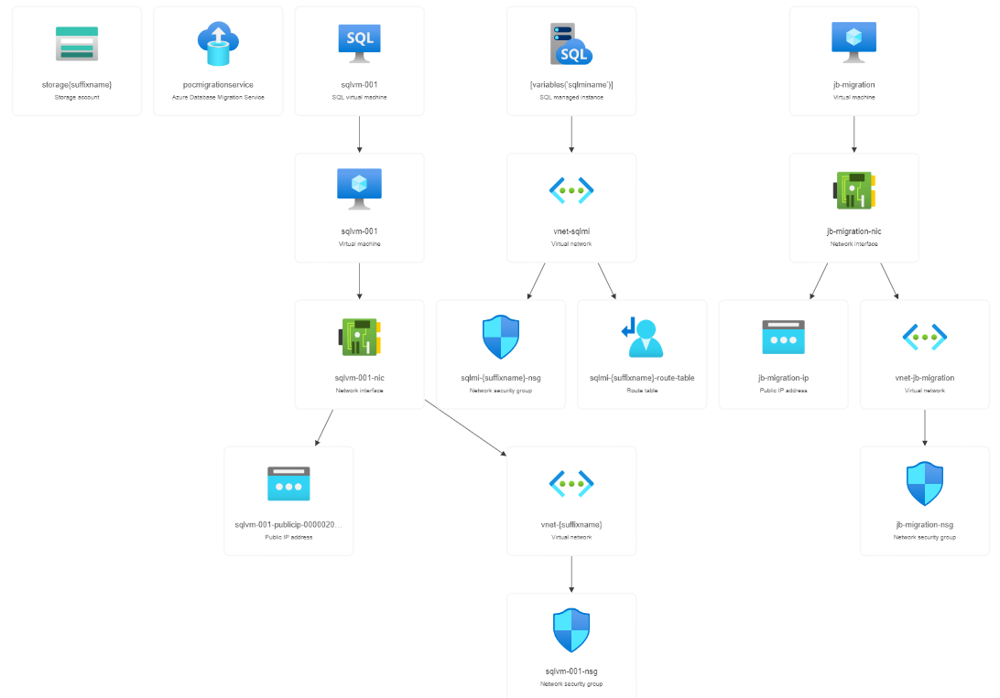

[SQL Server migration one-click PoC to Azure SQL](../../README.md) > Deploy the solution for Azure SQL Managed Instance

# Deploy the solution for Azure SQL Managed Instance

In this section, you will provision all Azure resources required to complete this PoC.

## Deployment options

| Deployment language |                                                                                                     |
| :-------------------------------: | :----------------------------------------------------------------------------------:  |
|[**ARM**](#azure-resource-manager) | [](#azure-resource-manager)  |
|[**Bicep**](#bicep)                | [](#bicep)                                        |
|[**Terraform**](#terraform)        | [](#terraform)                            |

## Deployment diagram



## Azure Resource Manager

[](https://portal.azure.com/#create/Microsoft.Template/uri/https%3A%2F%2Fraw.githubusercontent.com%2Fmicrosoft%2FSQL-Migration-AzureSQL-PoC%2Fmain%2FAzureSQLMI%2Fdeploy%2Ftemplate-latest.json)

The [ARM template (template-latest.json)](template-latest.json) is used to provision 24 Azure resources in a resource group.

Right-click or `Ctrl + click` the button below to open the Azure Portal in a new window. This will redirect you to the Custom Deployment wizard in the Azure Portal.

Select the Azure subscription and the resource group that you would like to use for this PoC.

## Bicep

The [Bicep template (template-latest.bicep)](template-latest.bicep) is used to provision 24 Azure resources in a  resource group.

 [Learn more about bicep](https://learn.microsoft.com/en-us/azure/azure-resource-manager/bicep/overview?tabs=bicep).

### Prerequisites

- [Install Bicep tools](https://learn.microsoft.com/en-us/azure/azure-resource-manager/bicep/install#azure-cli)
- [Azure CLI](https://learn.microsoft.com/en-us/cli/azure/install-azure-cli)

### How to deploy it

1. Run the following to log in from your client using your default web browser

    ```dotnetcli
    az login
    ```

    If you have more than one subscription, you can select a particular subscription.

    ```dotnetcli
    az account set --subscription <subscription-id>
    ```

2. Find a location you want to deploy the resource group
  
    ```dotnetcli
    az account list-locations -o table
    ```

3. Create a resource group

    ```dotnetcli
    az group create --location "<location>" --name "<resource group name>"
    ```

    The following example deploys a resource group in North Europe

    ```dotnetcli
    az group create --location "northeurope" --name "one-click-poc"
    ```

4. Deploy a bicep template

    ```dotnetcli
    az deployment group create --resource-group "<resource group name>" --template-file C:\temp\bicep\template-latest.bicep

    ```

    The following example deploys a bicep template

    ```dotnetcli
    az deployment group create --resource-group "one-click-poc" --template-file C:\temp\bicep\template-latest.bicep
    ```

## Terraform

Stay tuned. It's coming soon!

## Azure Resources

The template provisions the following resources in the Azure subscription

- Azure Resource Group
- Azure Storage Account
- Azure SQL Managed Instance
- VNet for Azure SQL Managed Instance
- NSG for Azure SQL Managed Instance
- Virtual network traffic routing
- Azure SQL VM
- Network interface for Azure SQL VM
- VNet for Azure SQL VM
- Public IP for Azure SQL VM
- NSG for Azure SQL VM
- JumpBox VM
- Network interface for JumpBox VM
- VNet for JumpBox VM
- NSG for JumpBox VM
- Public IP for JumpBox VM
- Virtual network peering

> [!IMPORTANT]
> Please note that it takes 6 to 8 hours approximately to provision all these resources in an Azure subscription.

Some of the Azure services provisioned require a globally unique name and a “suffix” has been added to their names to ensure uniqueness.

| Azure Service              | Name             | Pricing Tier      | How to    |
|:----                       |:-----            | :----             |:-----     |
| Resource Group             | one-click-PoC    |                   | [Create a Resource Group](https://learn.microsoft.com/en-us/azure/azure-resource-manager/management/manage-resource-groups-portal#create-resource-groups)
| Storage Account            | storage*suffix*  |                   |[Create a storage account](https://learn.microsoft.com/en-us/azure/storage/common/storage-account-create?tabs=azure-portal)|
| SQL Server on Azure VM     | sqlvm-001   | Standard_D8s_v3   |[Provision SQL Server on Azure VM](https://learn.microsoft.com/en-us/azure/azure-sql/virtual-machines/windows/create-sql-vm-portal?view=azuresql) |
| Azure SQL Managed Instance | sqlmi-*suffix*   | GP_Gen5 8vCore    |[Create an Azure SQL Managed Instance](https://learn.microsoft.com/en-us/azure/azure-sql/managed-instance/instance-create-quickstart?view=azuresql)|
| Azure VM                  | jb-migration      | Standard_B2s      |[Create a Windows virtual machine](https://learn.microsoft.com/en-us/azure/virtual-machines/windows/quick-create-portal) |

### Credential

|                       | Admin User Name   | Password         |
|:----                  |:-----             | :----            |
| SQL VM                | sqladmin          | My\$upp3r\$ecret |
| Azure SQL Database    | sqladmin          | My\$upp3r\$ecret |
| JumpBox VM            | sqladmin          | My\$upp3r\$ecret |

## Page Navigator

[Assessment and SKU recommendation for Azure SQL Managed Instance](../assessment/README.md)

[Offline migration for Azure SQL Managed Instance](../migration/offline.md)

[Online migration for Azure SQL Managed Instance](../migration/online.md)

[SQL Server migration one-click PoC to Azure SQL](../../README.md)

[Index: Table of Contents](../../index.md)
