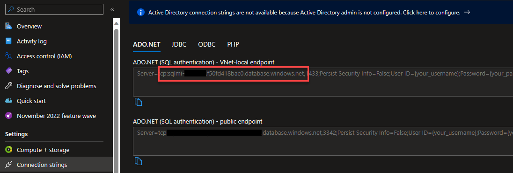
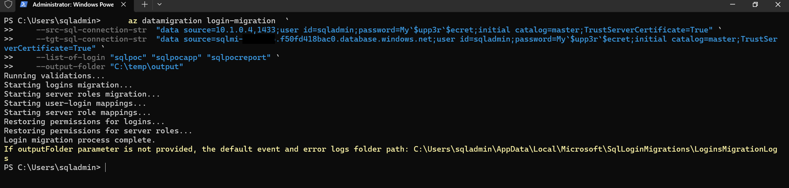

# Login migration for Azure SQL Managed Instance using PowerShell

Perform a login migration of your SQL Server databases running on-premises, SQL Server on Azure Virtual Machines, or any virtual machine running in the cloud (private, public) to Azure SQL Managed Instance using the Azure SQL Migration extension.

## Migration using Azure storage

### Prerequisites

- SQL Server with Windows authentication or SQL authentication access
- .Net Core 3.1 (Already installed)
- Az.DataMigration PowerShell module

## Getting Started

> [!CAUTION]
>
> - **Connect to the Jump Box VM**
> - VM name: **jb-migration**
> - Use the credentials provided on the deploy page.

Open a [Terminal](https://apps.microsoft.com/store/detail/windows-terminal/9N0DX20HK701?hl=en-us&gl=us). It is already installed in the VM and by default it uses PowerShell.

1. Run the following to log in from your client using your default web browser if you are not logged in.

    ```powershell
    Connect-AzAccount -Subscription <Subscription-id>
    ```

    If you have more than one subscription, you can select a particular subscription.

    ```powershell
    Set-AzContext -SubscriptionId <subscription-id>
    ```

    The [Azure SQL migration extension for Azure Data Studio](https://learn.microsoft.com/en-us/sql/azure-data-studio/extensions/azure-sql-migration-extension?view=sql-server-ver16) enables you to assess, get Azure recommendations and migrate your SQL Server databases to Azure.

    In addition, the PowerShell command [Data Migration](https://learn.microsoft.com/en-us/powershell/module/az.datamigration/?view=azps-10.0.0#data-migrationt) can be used to manage data migration at scale.

2. Verify SQL Logins to be migrated

    Open the Azure Data Studio, connect to the *Azure SQL VM* (**10.1.0.4**) using the "**sqladmin**" user and password and run the following T-SQL statement to see all SQL Logins.

    ```sql
    SELECT 
        sp.name AS server_login_name, 
        dp.name AS database_user_name, 
        sp.type_desc, 
        sp.is_disabled
    FROM sys.server_principals AS sp
    INNER JOIN WideWorldImportersDW.sys.database_principals AS dp ON SP.sid = DP.sid
    ```

### Start login migration

> [!CAUTION]
>
> - **Connect to the Jump Box VM**
> - VM name: **jb-migration**
> - Use the credentials provided on the deploy page.

At this point you will need to get the Azure SQL MI name. [Get server connection information](https://learn.microsoft.com/en-us/azure/azure-sql/database/connect-query-content-reference-guide?view=azuresql#get-server-connection-information)



1. Use the **New-AzDataMigrationLoginsMigration** command to create and start a database migration.

    ```powershell
        New-AzDataMigrationLoginsMigration `
        -SourceSqlConnectionString "data source=10.1.0.4,1433;user id=sqladmin;password=My`$upp3r`$ecret;initial catalog=master;TrustServerCertificate=True" `
        -TargetSqlConnectionString "data source=<managed instance name>.database.windows.net;user id=sqladmin;password=My`$upp3r`$ecret;initial catalog=master;TrustServerCertificate=True" `
        -ListOfLogin "sqlpoc" "sqlpocapp" "sqlpocreport" `
        -OutputFolder "C:\temp\output" 
    ```

    > [!WARNING]
    >
    > Change the **managed instance name**

    > [!TIP]
    >
    > Windows accounts are out of scope but if you want to learn how to migrate them, check out this [prerequisites](<https://learn.microsoft.com/en-us/azure/dms/tutorial-login-migration-ads#prerequisites>

    

2. **Login migration at scale** using config file

    Learn more about [Migrate SQL Server logins](https://learn.microsoft.com/en-us/azure/dms/tutorial-login-migration-ads#configure-login-migration-settings)

## Page Navigator

- [SQL Server migration one-click PoC to Azure SQL](../../../README.md)
  
- [One-click PoC to Azure SQL DB](../../../AzureSQLDB/deploy/README.md)
  - ***Assessment and SKU recommendation***
    - [CLI](../../../AzureSQLDB/assessment/CLI/azuresqldb-assessment-sku-using-cli.md)
    - [PowerShell](../../../AzureSQLDB/assessment/PowerShell/azuresqldb-assessment-sku-using-ps.md)
  - ***Offline migration***
    - [CLI](../../../AzureSQLDB/migration/CLI/azuresqldb-offline-migration-using-cli.md)
    - [PowerShell](../../../AzureSQLDB/migration/PowerShell/azuresqldb-offline-migration-using-ps.md)
  
- [One-click PoC to Azure SQL MI](../../../AzureSQLMI/deploy/README.md)
  - ***Assessment and SKU recommendation***
    - [CLI](../../../AzureSQLMI/assessment/CLI/azuresqlmi-assessment-sku-using-cli.md)
    - [PowerShell](../../../AzureSQLMI/assessment/PowerShell/azuresqlmi-assessment-sku-using-ps.md)
  - ***Offline migration using Storage Account***
    - [CLI](../../../AzureSQLMI/migration/CLI/azuresqlmi-offline-migration-using-azure-storage-cli.md)
    - [PowerShell](../../../AzureSQLMI/migration/PowerShell/azuresqlmi-offline-migration-using-azure-storage-ps.md)
  - ***Offline migration using File Share***
    - [CLI](../../../AzureSQLMI/migration/CLI/azuresqlmi-offline-migration-using-file-share-cli.md)
    - [PowerShell](../../../AzureSQLMI/migration/PowerShell/azuresqlmi-offline-migration-using-file-share-ps.md)
  - ***Online migration using Storage Account***
    - [CLI](../../../AzureSQLMI/migration/CLI/azuresqlmi-offline-migration-using-azure-storage-cli.md)
    - [PowerShell](../../../AzureSQLMI/migration/PowerShell/azuresqlmi-online-migration-using-azure-storage-ps.md)
  - ***Online migration using File Share***
    - [CLI](../../../AzureSQLMI/migration/CLI/azuresqlmi-offline-migration-using-file-share-cli.md)
    - [PowerShell](../../../AzureSQLMI/migration/PowerShell/azuresqlmi-offline-migration-using-file-share-ps.md)
  - ***Login migration***
    - [CLI](../../../AzureSQLMI/migration/CLI/azuresqlmi-login-migration-using-cli.md)
    - [PowerShell](../../../AzureSQLMI/migration/PowerShell/azuresqlmi-login-migration-using-ps.md)
